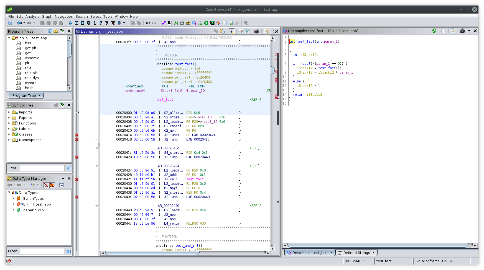

# Ghidra hexagon plugin

WIP Hexagon decompiler plugin for ghidra



Pcode is more or less autogenerated, essentially copying and adapting from
[binja-hexagon](https://github.com/google/binja-hexagon)

# Known issues

### Low-level Error: Overlapping input varnodes

This frustrating error causes decompilation to fail after autoanalysis. I
haven't root caused this, but the issue is caused by an exception in
ActionInputPrototype. 

A temporary fix is to recompile the decompiler with this patch

```diff
diff --git a/Ghidra/Features/Decompiler/src/decompile/cpp/coreaction.cc b/Ghidra/Features/Decompiler/src/decompile/cpp/coreaction.cc
index ae0b1c3a3..caf761204 100644
--- a/Ghidra/Features/Decompiler/src/decompile/cpp/coreaction.cc
+++ b/Ghidra/Features/Decompiler/src/decompile/cpp/coreaction.cc
@@ -5263,7 +5263,7 @@ void ActionDatabase::universalAction(Architecture *conf)
   act->addAction( new ActionHideShadow("merge") );
   act->addAction( new ActionCopyMarker("merge") );
   act->addAction( new ActionOutputPrototype("localrecovery") );
-  act->addAction( new ActionInputPrototype("fixateproto") );
+  // act->addAction( new ActionInputPrototype("fixateproto") );
   act->addAction( new ActionRestructureHigh("localrecovery") );
   act->addAction( new ActionMapGlobals("fixateglobals") );
   act->addAction( new ActionDynamicSymbols("dynamic") );
```

Make sure the changes stick by running

```
gradle buildNatives
```

Then set the function arguments manually by reading the function. Once the
arguments to the function are explicitly set, ActionInputPrototype
short-circuits so you can safely re-enable the patch.

### Spurious `CALL_RETURN` flow override

Some analyzer aggressively inserts the `CALL_RETURN` flow override, which
appears like this in the listing:

```
c04f4040 22 58 67 5b  {  J2_call    FUN_c002f084
                     -- Flow Override: CALL_RETURN (CALL_TERMINATOR)
```

I get around this by disabling the "Non-returning Functions - Discovered"
analyzer during auto-analysis
